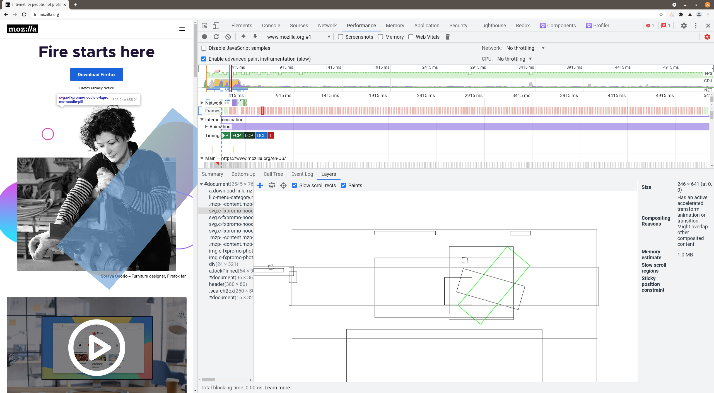

While rendering the browser paints the elements on potentientally more than one layer. Those are composed into the final image that is drawn to the screen.

In the Chrome DevTools those layers can be inspected.

## Show Layer Borders in Rendering Tab

Go to `Chrome > More tools > Rendering`. Here you can select `Layer Borders` which will ... well draw borders around the layers on the screen. 

## Analyze Layers in Performance Tab

To analyze the layers in the Chrome Performance Tab you first have to activate `enable advanced paint instrumentation` in the [Recording Settings](https://developer.chrome.com/docs/devtools/evaluate-performance/reference/#settings) - those can be found when clicking the gear icon in the Performance Tab.

Now you can record a Performance Snapshot as usual. When analyzing the profile you can select a certain frame and inspect the corresponding layer information in the Layers Tab.

