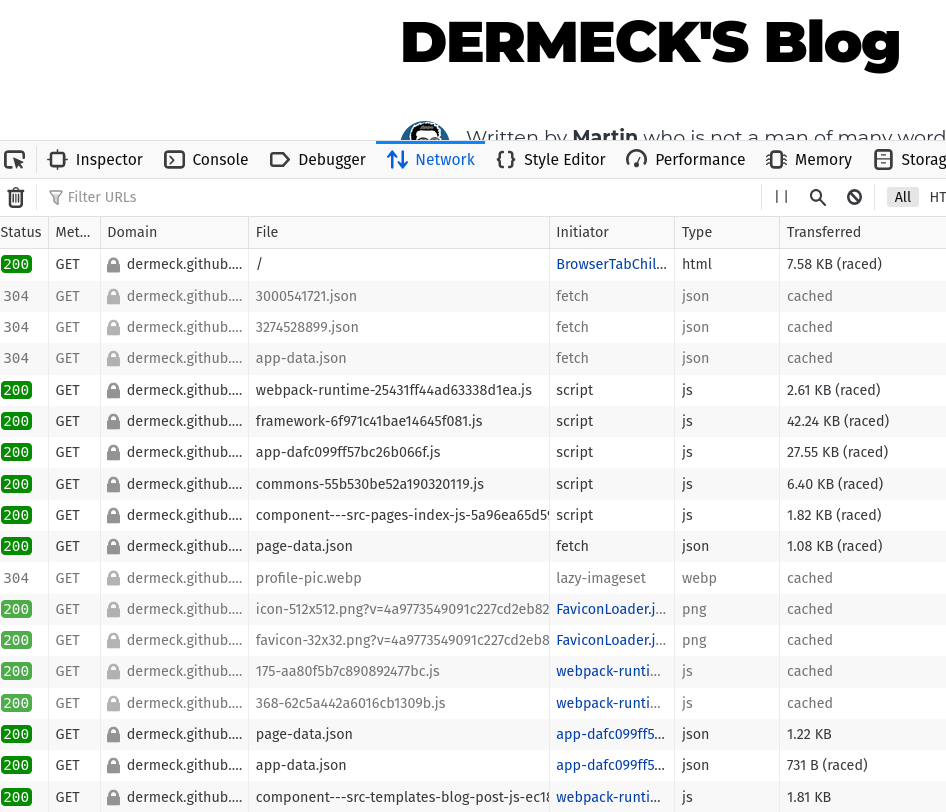

Today I realised that Gatsby is shipping JavaScript files and I was wondering why. 

Up until now I thought the goal of static site generators is to create a static site which in my world view were prerendered HTML files with a static content. I was not expecting any JavaScript since it adds dynamic behaviour to that page. 

I was surprised when I saw several JS files loaded in the Network tab.

Turns out I was wrong. I did some research and the number one source of knowledge a.k.a. Wikipedia states:

> A static web page (sometimes called a flat page or a stationary page) is a web page that is delivered to the user's web browser exactly as stored, in contrast to dynamic web pages which are generated by a web application. 

 The word *static* is a bit misleading here and only refers to the fact that files delivered by the server are static. The server does not do anything else except serving files from the hard disk, things like database accces and template processing are not happening.

 Those files can still be JavaScript files which add interactivity to the site. Technically even a SPA is a static website if no further interaction with the server is happening after the initial page load - I guess?

 I'm not sure and in the end it might not really matter how this is labeled exaclty. 
 
 The important learning of the day is that Gatsby ships JavaScript files. I also found a [blog post](https://www.gatsbyjs.com/blog/2020-01-30-why-gatsby-is-better-with-javascript/) where they described why.
